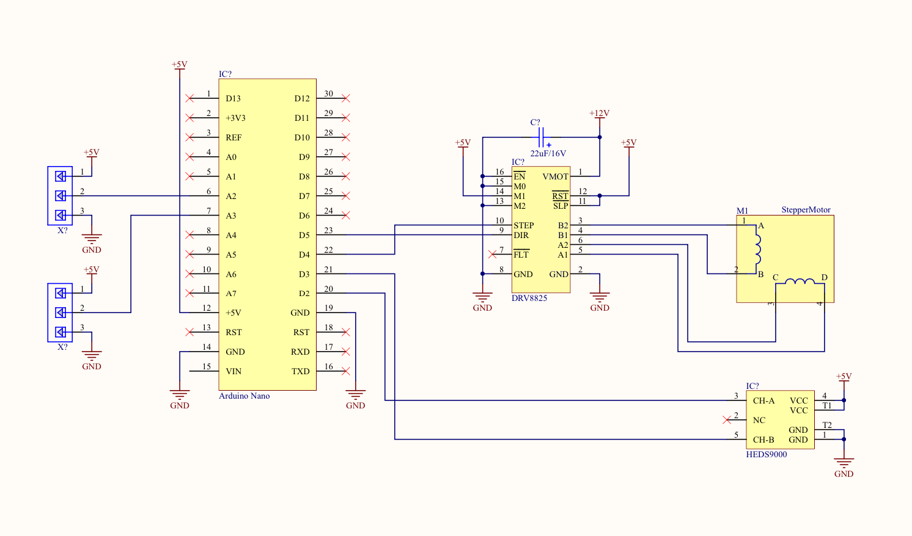

# Electronics

This system is fairly simple to wire up, it's mostly just connecting up off the shelf components, it doesn't really involve much deep understanding of electronics. I am not going to go into huge detail on how the system works electronically but I will mention a few important gotchas. Firstly and main two components are an Arduino Nano microcontroller and a DRV8825 stepper driver.

The motor driver board has in it's specs that you need to attach a capacitor between the positive and negative 12V DC input. I initially ignored it as I didn't have the value of cap they mentioned. DO NOT IGNORE THIS! I fried two boards and had no idea why, I added a 22uF cap I had lying around and haven't had any issues since.

The motor driver board needs 12V to run, so make sure you have a decent 12V power supply. Also depending on your motor, you will need to be able to draw somewhere around 1-2A from the supply at this voltage. So make sure your supply can do this. Another note on supply voltages and and currents, the motor driver board has a small pot on it called the trim pot. This pot sets the current that the motor can draw from the board. I recommend you do some reading around this as all motors are different and I have no idea what kind you will pick. In short, if you motor is squealing, it might be running with the wrong drive current, you can tweak it and see.

Finally, the circuit here won't work with just the 12V power supply. As I decided that I always wanted to plot the ball position etc via the computer, the Arduino microcontroller needs to be powered via it's USB for the system to work. This means either having it connected to the computer or an external 5V power supply. DO NOT CONNECT THE ARDUINO TO THE 12V DC SUPPLY.

## Breadboard vs Protoboard vs PCB

The system worked fine for me when assembled on a breadboard. However, I wanted to put this on a shelf for display. I decided to build my circuit onto a piece of solderable protoboard. You don't need to do this, it won't make the rig any better but will make it look nicer. Even better still, if you design a PCB (which I just wasn't bothered doing), it'll look even nicer!!
